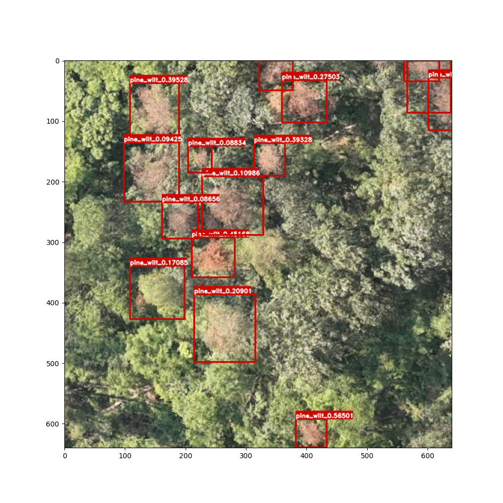

# PineWilt-Detection

📌 Project Overview
PineWilt-Detection is dedicated to providing out-of-the-box inference capabilities for pine wilt disease detection. This repository only includes:
Pre-trained model weights (optimized for inference efficiency)
Inference code (supports image single/mass detection, result visualization)
Simple deployment guidance
The project is designed for developers, forestry technicians, and researchers who need to quickly apply pine wilt disease detection models in production environments, without involving complex training processes.

PineWilt-Detection 致力于为松材线虫病检测提供开箱即用的推理能力。本仓库仅包含：
预训练模型权重（针对推理效率优化）
推理代码（支持图片单张 / 批量检测、结果可视化）
简易部署指引
项目面向需要在生产环境快速落地松材线虫病检测模型的开发者、林业技术人员及研究人员，不涉及复杂的训练流程。

🚀 Quick Start

python infer_api_onnx.py

📦 Model Weights

Huggingface: to be released !!!

